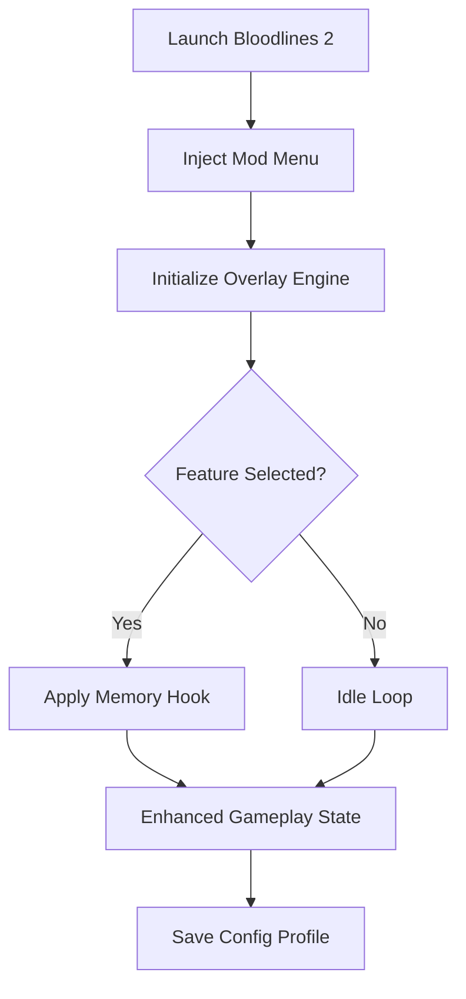

# 🩸 Vampire: The Masquerade – Bloodlines 2 Mod Menu Overview

The **Bloodlines 2 Mod Menu** delivers complete control over your vampiric abilities, environment, and narrative flow. This is not a simple trainer — it’s a *full-scale control suite* designed for players who want to rewrite the rules of their undead experience.

Whether you crave infinite blood reserves, godlike stealth, or advanced dialogue freedom, this mod menu gives you total command over your journey through the World of Darkness.

Built for smooth injection, optimized for modern hardware, and styled for immersive use, it’s your ultimate companion in Seattle’s neon-shadowed streets.

---

## ⚙️ Core Features

**🧛 Vampiric Mastery**

* *Infinite Blood Pool* – Cast powers endlessly without feeding.
* *No Cooldowns* – Use Disciplines and combat skills without delay.
* *Invulnerability Mode* – Survive sunlight, silver, and human weapons alike.

**🧠 Clan Customization**

* Change your **clan** mid-playthrough (Brujah, Toreador, Nosferatu, Tremere).
* Mix abilities across clans for hybrid builds.
* Modify appearance attributes and dialogue influence stats.

**🌒 Environment & Gameplay**

* Control time progression between night cycles.
* Unlock restricted areas and NPC dialogues.
* Adjust lighting, fog density, and NPC hostility radius.

**🎮 Interface & Accessibility**

* In-game overlay (`F9` default).
* Real-time toggles with instant visual feedback.
* Adjustable opacity and theme for dark/night modes.

---

## 🧩 Compatibility Matrix

| Platform        | Supported  | Notes                           |
| --------------- | ---------- | ------------------------------- |
| Windows 10/11   | ✅          | Native injector supported       |
| Steam           | ✅          | Fully compatible                |
| Epic Games      | ⚙️ Partial | Manual directory setup required |
| Gamepad Support | ✅          | Navigate via D-Pad & triggers   |

> [!NOTE]
> Run the menu only *after* the title screen loads. Injecting too early may cause script desyncs during intro cutscenes.

---

## 🧛 Setup & Activation

1. **Download** the `Bloodlines2_ModMenu.zip` archive.
2. **Extract** the folder to your main game directory.
3. **Run** `VTM2MenuLoader.exe` as Administrator.
4. Wait for the status: *“Overlay Connected”*.
5. Press `F9` to toggle the Mod Menu in-game.

Example configuration:

```ini
[Player]
InfiniteBlood=True
GodMode=True
ClanOverride=Tremere

[World]
FogDensity=0.4
NPCVisionRange=0.7
TimeCycleControl=True

[Hotkeys]
ToggleMenu=F9
QuickHeal=F5
Vanish=F8
```

---

## 🧠 How It Works



---

## 🌌 Performance & Stability

| Feature          | CPU Impact | GPU Load | Notes                   |
| ---------------- | ---------- | -------- | ----------------------- |
| Infinite Blood   | <1%        | None     | Safe toggle             |
| Environment Mod  | 3%         | Low      | Affects light rendering |
| ESP & NPC Vision | 4%         | Moderate | Adjustable refresh rate |

> [!IMPORTANT]
> Disable third-party overlays like MSI Afterburner or Discord before launching to prevent overlay conflicts.

---

## 🧩 Advanced Controls

**Hybrid Clan Example:**

```ini
[CustomBuild]
Clan=Nosferatu
Disciplines=Obfuscate,Potence,Dominate
CooldownReduction=100
BloodDrainRate=0
```

**Night Control Example:**

```ini
[Environment]
TimeOfNight=2:00
Weather=Overcast
```

Use the in-menu console (`~`) for runtime commands like:

```
set_blood 100
toggle_sunlight off
teleport_downtown
```

> [!TIP]
> Combine “No Cooldowns” with “Hybrid Clan Mode” for the ultimate power fantasy build.

---

## ❓ FAQ

### 🧛 1. Is the Mod Menu safe?

Yes. It’s isolated in runtime memory and does not modify your original game files.

### 🌒 2. Can I switch clans mid-story?

Yes, though certain dialogue branches may remain linked to your starting clan’s storyline.

### ⚙️ 3. Does it affect saves?

No permanent changes are written unless you manually export your config.

### 🔁 4. How often is it updated?

The loader checks for patches at startup and syncs offsets automatically.

### 🎨 5. Can I edit the UI?

Yes. You can edit color palettes in `UI_Theme.json` for dark red, grey, or obsidian styles.

---

## 🩸 Troubleshooting

If the overlay fails to open:

* Ensure **DirectX 12** mode is active in your graphics settings.
* Run as Administrator to allow memory access.
* Restart both game and loader if “Menu Failed to Attach” appears.

> [!WARNING]
> Do **not** use alongside other injectors or shader mods simultaneously — overlapping hooks may crash the client.

---

## 🏁 Final Thoughts

The **Vampire: The Masquerade – Bloodlines 2 Mod Menu** is built for those who desire total freedom within the darkness. Whether you’re experimenting with custom clans, exploring Seattle’s underworld unshackled, or crafting cinematic playthroughs — this mod gives you the tools to *become the ultimate predator*.

Embrace the night. Rule the city.

---

**Vampire: The Masquerade – Bloodlines 2 Mod Menu** — command the blood, shape the night, and rewrite immortality.
